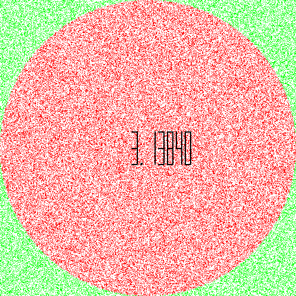

## Projet de modélisation de la méthode de Monte Carlo pour approximer $\pi$

Ce projet a été effectué dans le cadre du cours Base de la Programmation Impérative, en 1A à l'Ensimag.

Toutes les informations relatives au projet se trouvent ici :

**https://bpi-etu.pages.ensimag.fr/projet/index.html**

Le programme se décompose en deux fichiers Python qui doivent:

    - calculer une valeur approximative de π à l'aide d'une simulation de Monte-Carlo ;
    - générer une image animée représentant la simulation comme ci-dessous.

Pour l'exécuter, utiliser la commande:
`python3 draw.py [taille de l'image] [nombre de points] [nombre de chiffres après la virgule]`

Exemple:
`python3 draw.py 800 800000 5`

